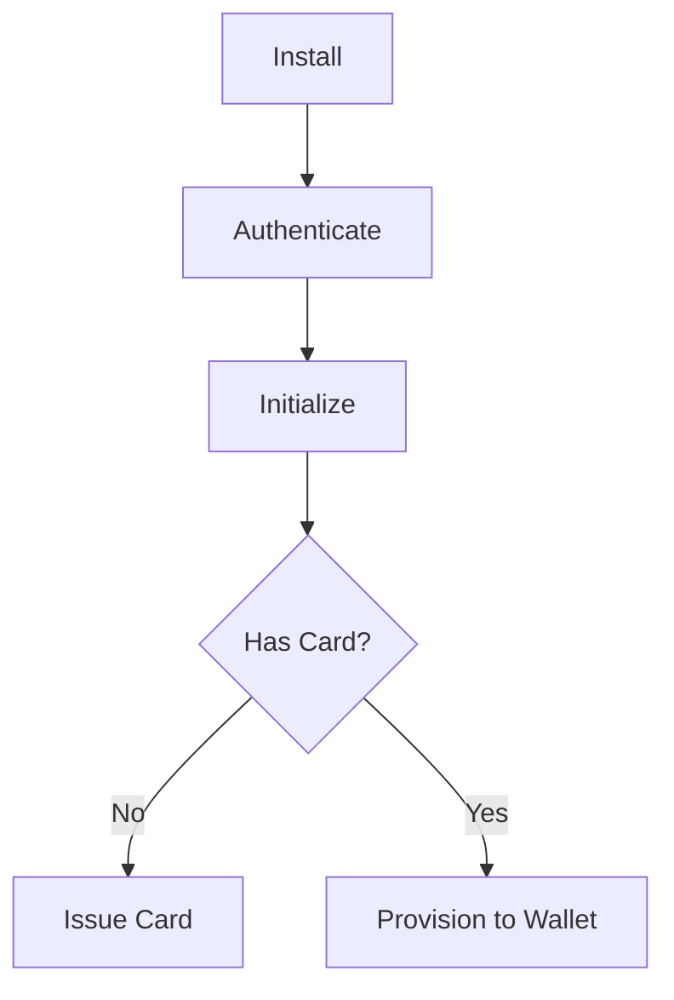

CoinBridge is a payment enablement solution that allows users to spend their digital assets such as loyalty points or frequent flyer miles as a standard payment method on their mobile device.

By integrating via SDK and backend webhooks, it facilitates the direct debit of these balances during a transaction, effectively turning "stored value" into immediate purchasing power.

These are the functional pillars:

- **Asset Liquidity**: Converts non-cash balances (miles, points, etc.) into a functional payment tool for the end-user.

- **On-Device Enablement**: Leverages an SDK to establish the payment method directly within the user's device ecosystem.

- **Real-Time Settlement**: Uses backend webhooks to ensure that when a purchase is made, the corresponding balance is instantly drawn from the application’s ledger.

- **Seamless Integration**: Connects the app's existing reward infrastructure to the external payment environment without requiring the user to manually convert points into vouchers.

See more about our process:

<CardGroup cols={2}>
  <Card title="Integration Process" icon="gears" href="/docs/get-started/integration-process">
   View the foundational architecture of CoinBridge and the logic behind our integration model.
  </Card>

  <Card title="Payment Flow" icon="arrow-right-arrow-left" href="/docs/get-started/payment-flow">
    Follow the developer journey from initial environment setup to processing a payment.
  </Card>

  <Card title="SDK Guides" icon="mobile-screen" href="/docs/sdk/index">
    Build native experiences with our dedicated integration libraries for both Android and iOS.
  </Card>

  <Card title="Webhook Guides" icon="bridge-water" href="/docs/webhooks/index">
    Stay in sync with real-time status updates by connecting your backend to our event system.
  </Card>
</CardGroup>


```mermaid
graph TD
    Start((App Launch)) --> AuthCheck{Is Authenticated?}
    
    AuthCheck -- No --> B[Authenticate]
    AuthCheck -- Yes --> C[Initialize]

    B -->|Wait for Callback| C
    
    C -->|onInitComplete| D{Has Card?}
    
    D -- No --> E[Check Eligibility]
    D -- Yes --> F{Is Provisioned?}
    
    E -- Eligible --> G[Issue Card]
    E -- Not Eligible --> Error[Contact Support]
    
    G -->|Wait for Success| F
    
    F -- No --> H[Provision to Wallet]
    F -- Yes --> Ready((Ready to Pay))
    
    H -->|Wait for Change| Ready

    click B "/docs/sdk/installation/authentication" "Go to Authentication"
    click C "/docs/sdk/installation/initialize" "Go to Initialize"
    click E "/docs/sdk/installation/eligibility" "Go to Eligibility"
    click G "/docs/sdk/installation/issue-card" "Go to Issue Card"
    click H "/docs/sdk/installation/add-to-wallet" "Go to Add to Wallet"
    ```


```mermaid
    graph TD
    %% Node Definitions
    Start((App Launch))
    AuthCheck{Authenticated?}
    Auth[Authenticate]
    Init[Initialize SDK]
    Elig{Is Eligible?}
    Issue[Issue Card]
    Prov{Provisioned?}
    Add[Add to Wallet]
    Ready((Ready to Pay))
    Support[Contact Support]

    %% Flow Logic
    Start --> AuthCheck
    AuthCheck -- No --> Auth
    AuthCheck -- Yes --> Init
    
    Auth -->|Wait for Response| Init
    
    Init -->|onInitComplete| Elig
    
    Elig -- Yes --> Issue
    Elig -- No --> Support
    
    Issue -->|hasCard=True| Prov
    
    Prov -- No --> Add
    Prov -- Yes --> Ready
    
    Add -->|Token ACTIVE| Ready

    %% Styling (Yellow Tones)
    classDef yellowNode fill:#FFF9C4,stroke:#FBC02D,stroke-width:2px,color:#5D4037;
    classDef goldNode fill:#FFECB3,stroke:#FFA000,stroke-width:2px,color:#5D4037;
    classDef highlight fill:#FFD54F,stroke:#FF8F00,stroke-width:3px,color:#000,font-weight:bold;
    classDef terminal fill:#FFFDE7,stroke:#FFEE58,stroke-width:1px,dasharray: 5 5;

    class Auth,Init goldNode;
    class Elig,Issue,Add yellowNode;
    class Ready highlight;
    class Start,Support terminal;

    %% Interactive Links
    click Auth "/docs/sdk/auth" "View Authentication Guide"
    click Init "/docs/sdk/init" "View Initialization Guide"
    click Issue "/docs/sdk/issuing" "View Issuing Guide"
    click Add "/docs/sdk/provisioning" "View Wallet Guide"
    ```