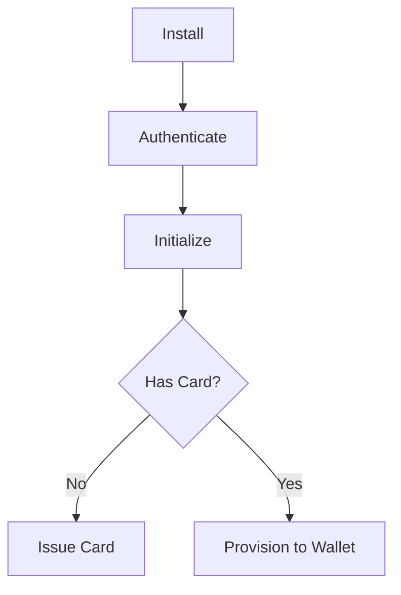

Coinbridge's integration process follows several stages, ensuring the solution is implemented and tested before going live. The following diagram illustrates the integration process.


The steps in this process are as follows:

### 1. Get JWT Keys for Sandbox
Think of this as creating a digital ID card. You’ll create a secure "key pair" (RSA) on your end. You keep the private one and send us the public one. In return, CoinBridge will give you an **Application Key** and **Repository Credentials**. These act like your all-access pass to download our tools and securely sign in to our system.

### 2. SDK Integration in Sandbox
Now, you’ll plug the CoinBridge software (SDK) into your app code using standard tools like Gradle (for Android) or SPM (for iOS). At this stage, you’ll also make sure your app has permission to use the phone’s **NFC, Biometrics, and Internet**. This ensures the app is ready to talk to the hardware and manage its internal state when it’s time to pay.

### 3. Webhook Integration
To make sure payments actually work, your servers need to talk to ours. You’ll set up the CoinBridge Back-End Connector using **Webhooks**, which act like automated messengers. 
* **Data-Fetching:** Tells us how much "money" (loyalty points or balance) a user has in real-time.
* **Data-Reporting:** Sends you a notification the moment a transaction is finished, refunded, or adjusted.

### 4. Test with Virtual EMV
Before going live, you can simulate a real-world "Tap & Go" purchase. By calling the `prepareToPay` method, you’ll trigger the phone’s wallet or NFC tool. You’ll "tap" against a virtual terminal to make sure the encrypted payment data is sent correctly and that your app receives the `TapComplete` signal.

### 5. CoinBridge Acceptance Testing
We provide a **Helper toolkit** to make sure everything is perfect. This step checks if the user’s phone settings (like NFC and "Pay with open app") are configured correctly. You’ll also verify user eligibility via the `isEligible` method and do a final check to ensure your branded card art and UI meet design guidelines.

### 6. Production Deployment
Once you’re certified, you’ll switch to the Production repository and update your app with the live **Production Application Key**. We recommend using a "feature flag" (an on/off switch on your server) to control the launch and a "Force Update" mechanism to ensure everyone is using the latest, most secure version of the SDK.

See more about our process: 

<CardGroup cols={3}>

  <Card title="Payment Flow" icon="arrow-right-arrow-left" href="/docs/get-started/payment-flow">
    Follow the developer journey from initial environment setup to processing a payment.
  </Card>

  <Card title="SDK Guides" icon="mobile-screen" href="/docs/sdk/index">
    Build native experiences with our dedicated integration libraries for both Android and iOS.
  </Card>

  <Card title="Webhook Guides" icon="bridge-water" href="/docs/webhooks/index">
    Stay in sync with real-time status updates by connecting your backend to our event system.
  </Card>
</CardGroup>



```mermaid
graph TD
    Start((App Launch)) --> AuthCheck{Is Authenticated?}
    
    AuthCheck -- No --> B[Authenticate]
    AuthCheck -- Yes --> C[Initialize]

    B -->|Wait for Callback| C
    
    C -->|onInitComplete| D{Has Card?}
    
    D -- No --> G[Issue Card]
    D -- Yes --> F{Is Provisioned?}
    
    G -->|Wait for Success| F
    
    F -- No --> H[Provision to Wallet]
    F -- Yes --> Ready((Ready to Pay))
    
    H -->|Wait for Change| Ready

    click B "/docs/sdk/installation/authentication" "Go to Authentication"
    click C "/docs/sdk/installation/initialize" "Go to Initialize"
    click G "/docs/sdk/installation/issue-card" "Go to Issue Card"
    click H "/docs/sdk/installation/add-to-wallet" "Go to Add to Wallet"
    ```


```mermaid
  graph TD
    %% Node Definitions
    Start((App Launch))
    AuthCheck{Authenticated?}
    Auth[Authenticate]
    Init[Initialize SDK]
    Issue[Issue Card]
    Prov{Provisioned?}
    Add[Add to Wallet]
    Ready((Ready to Pay))

    %% Flow Logic
    Start --> AuthCheck
    AuthCheck -- No --> Auth
    AuthCheck -- Yes --> Init
    
    Auth -->|Wait for Response| Init
    
    Init -->|onInitComplete| Issue
    
    Issue -->|hasCard=True| Prov
    
    Prov -- No --> Add
    Prov -- Yes --> Ready
    
    Add -->|Token ACTIVE| Ready

    %% Styling (Yellow Tones)
    classDef yellowNode fill:#FFF9C4,stroke:#FBC02D,stroke-width:2px,color:#5D4037;
    classDef goldNode fill:#FFECB3,stroke:#FFA000,stroke-width:2px,color:#5D4037;
    classDef highlight fill:#FFD54F,stroke:#FF8F00,stroke-width:3px,color:#000,font-weight:bold;
    classDef terminal fill:#FFFDE7,stroke:#FFEE58,stroke-width:1px,dasharray: 5 5;

    class Auth,Init goldNode;
    class Issue,Add yellowNode;
    class Ready highlight;
    class Start terminal;

    %% Interactive Links
    click Auth "/docs/sdk/auth" "View Authentication Guide"
    click Init "/docs/sdk/init" "View Initialization Guide"
    click Issue "/docs/sdk/issuing" "View Issuing Guide"
    click Add "/docs/sdk/provisioning" "View Wallet Guide"
    ```
