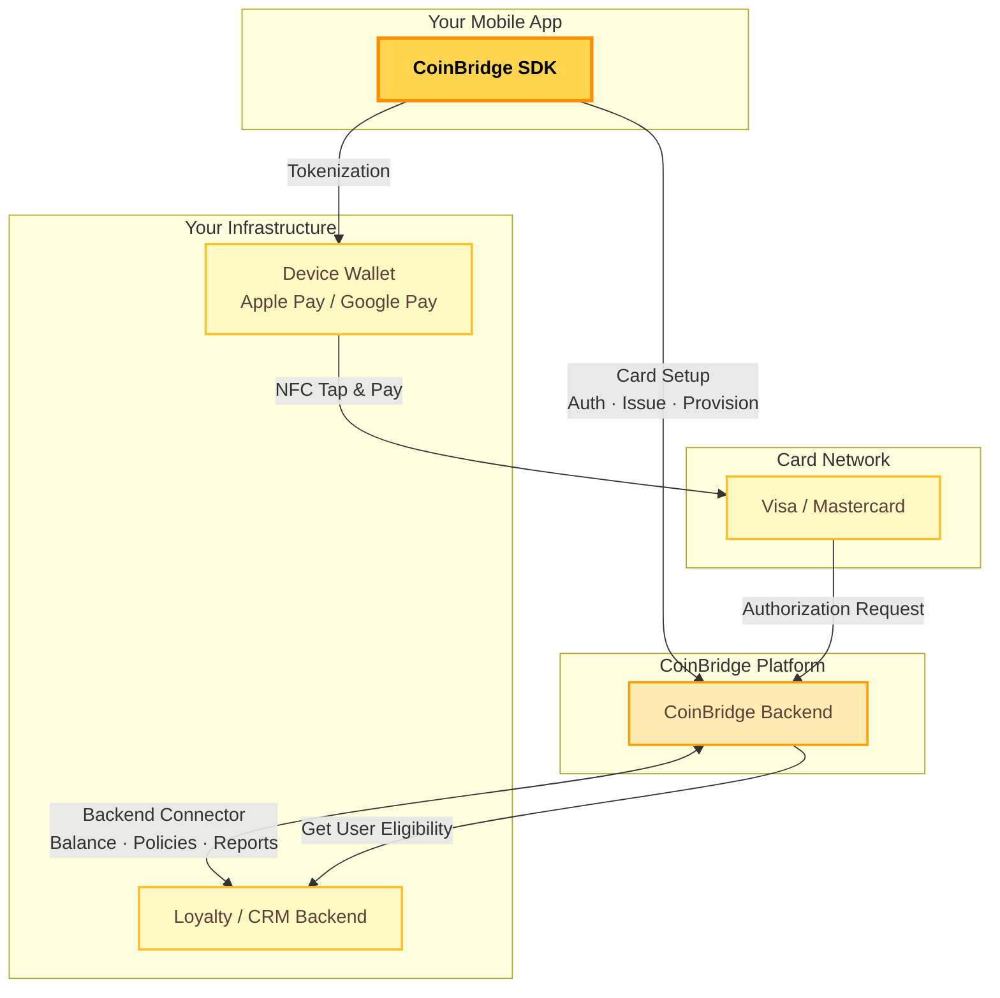

import WhatIsCoinBridge from '/snippets/what-is-coinbridge.mdx'

<WhatIsCoinBridge />

## System Architecture

The diagram below shows how each component fits together: from the SDK embedded in your app, through the CoinBridge platform, to your backend and the card networks.

<Note>
  This diagram is a placeholder for a final visual design to be provided by the CoinBridge team.
</Note>

## Where to go next

<CardGroup cols={2}>
  <Card title="Platform" icon="building" href="/docs/sdk/integration-journey">
    For project leads, product managers, and executives. Understand the integration milestones, timelines, and what each role owns.
  </Card>
  <Card title="Developer Guide" icon="code" href="/docs/sdk/to-start">
    For mobile and backend engineers. Step-by-step setup for the SDK, Backend Connector, and API.
  </Card>
</CardGroup>
